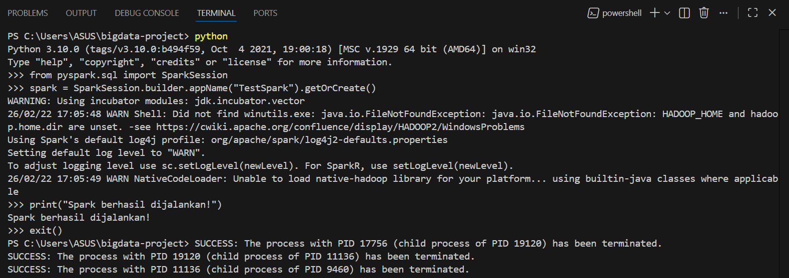
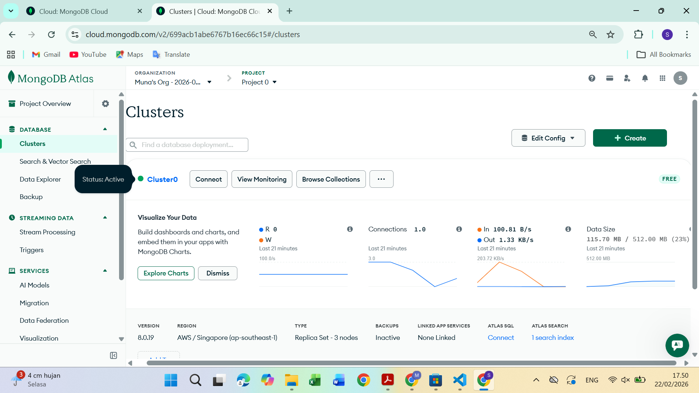
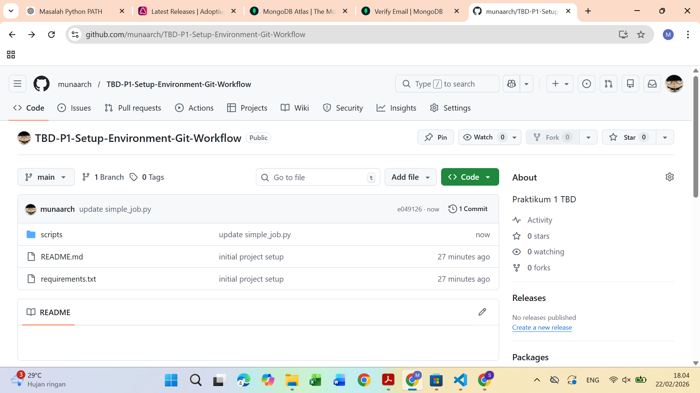
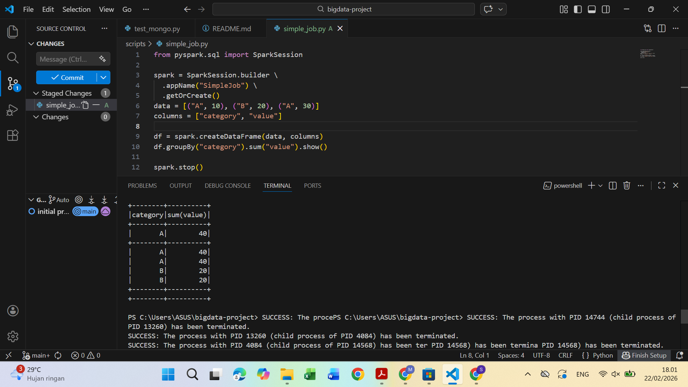
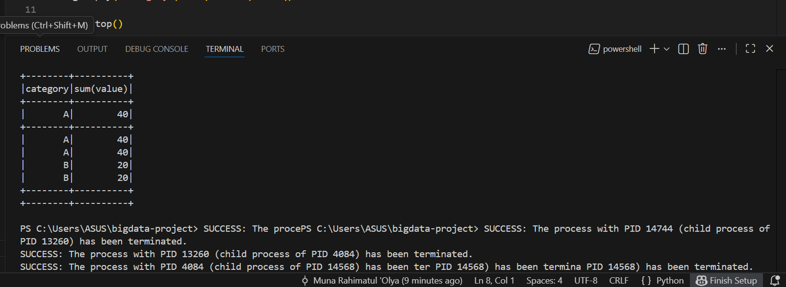

# Big Data Technology – Praktikum 1

**Setup Environment & Git Workflow (Spark + Cloud)**

## Identitas Mahasiswa

* **Nama:** Muna Rahimatul 'Olya
* **NIM:** 230104040081
* **Program Studi:** Teknologi Informasi
* **Universitas:** UIN Antasari Banjarmasin
* **Mata Kuliah:** Big Data Technology
* **Dosen Pengampu:** Muhayat, M.IT

---

## Deskripsi Project

Project ini merupakan implementasi praktikum pertama pada mata kuliah **Big Data Technology**, yang bertujuan untuk membangun environment dasar Data Engineer menggunakan:

* Python 3.10
* PySpark
* MongoDB Atlas (Cloud Database)
* Git & GitHub (Version Control)
* VS Code & PowerShell

Project ini mensimulasikan workflow profesional dalam pengolahan data menggunakan distributed processing engine (Apache Spark).

---

## Technology Stack

| Komponen             | Teknologi              |
| -------------------- | ---------------------- |
| Programming Language | Python 3.10            |
| Big Data Engine      | Apache Spark (PySpark) |
| Database             | MongoDB Atlas          |
| Version Control      | Git & GitHub           |
| Editor               | Visual Studio Code     |
| Terminal             | PowerShell             |
| Java                 | OpenJDK 17             |

---

## Struktur Project

```bash
bigdata-project/
│
├── data/                # Folder penyimpanan dataset
├── cloud_storage/      # Simulasi cloud storage
├── scripts/            # Script Python
│   ├── simple_job.py
│   └── test_mongo.py
│
├── notebooks/          # Notebook untuk eksplorasi data
├── reports/            # Laporan dan dokumentasi
│
├── requirements.txt    # Dependencies
└── README.md           # Dokumentasi project
```

---

## Setup Environment

### 1. Cek Python

```bash
python --version
```

---

### 2. Install PySpark

```bash
pip install pyspark
```

---

### 3. Test SparkSession

```python
from pyspark.sql import SparkSession

spark = SparkSession.builder \
    .appName("TestSpark") \
    .getOrCreate()

print("Spark berhasil dijalankan!")
```

---

## Spark Job Sederhana

File: `scripts/simple_job.py`

```python
from pyspark.sql import SparkSession

spark = SparkSession.builder \
    .appName("SimpleJob") \
    .getOrCreate()

data = [("A", 10), ("B", 20), ("A", 30)]
columns = ["category", "value"]

df = spark.createDataFrame(data, columns)

df.groupBy("category").sum("value").show()

spark.stop()
```

Run:

```bash
python scripts/simple_job.py
```

---

# Dokumentasi Hasil Praktikum

## 1. Screenshot Spark Berjalan

📷 Screenshot:

```

```

Deskripsi:
SparkSession berhasil dijalankan tanpa error.

---

## 2. Screenshot MongoDB Atlas Cluster Active

📷 Screenshot:

```

```

Deskripsi:
Cluster MongoDB Atlas berhasil dibuat dan berstatus ACTIVE.

---

## 3. Link Repository GitHub

🔗 Link Repository:


```
https://github.com/munaarch/bigdata-project

```



---

## 4. Screenshot File simple_job.py

📷 Screenshot:

```

```

Deskripsi:
Script Spark Job berhasil dibuat sesuai modul.

---

## 5. Screenshot Output Spark Job

📷 Screenshot:

```

```

Contoh Output:

```
+--------+----------+
|category|sum(value)|
+--------+----------+
|       A|        40|
|       B|        20|
+--------+----------+
```

---

# Status Validasi Praktikum

| Komponen          | Status     |
| ----------------- | ---------- |
| PySpark Setup     | ✅ Berhasil |
| MongoDB Atlas     | ✅ Berhasil |
| GitHub Repository | ✅ Berhasil |
| Spark Job         | ✅ Berhasil |
| Environment Setup | ✅ Berhasil |

---

# Insight Praktikum

Melalui praktikum ini, telah berhasil dibuat environment dasar Data Engineer yang mencakup:

* Setup Python environment
* Instalasi dan penggunaan Apache Spark
* Integrasi dengan database cloud MongoDB Atlas
* Penggunaan Git & GitHub untuk version control
* Menjalankan distributed data processing menggunakan Spark

Environment ini merupakan fondasi penting dalam pengembangan sistem Big Data.

---